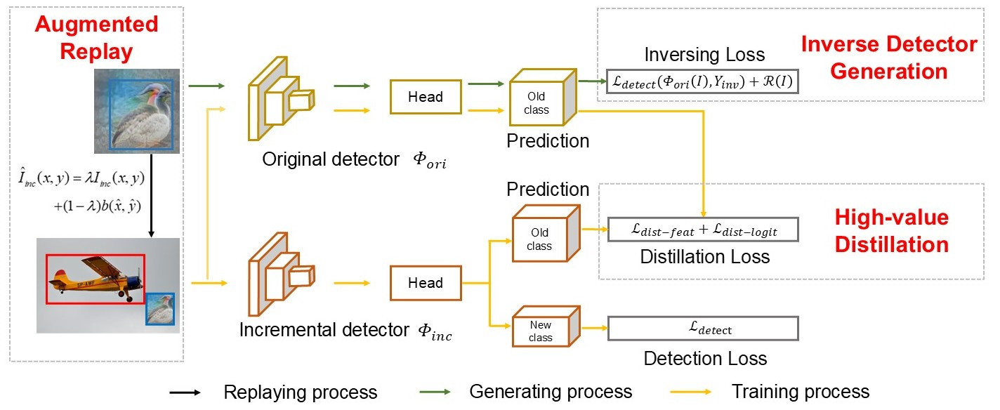

## IOR: Inversed Objects Replay for Incremental Object Detection

Official Pytorch implementation for "[IOR: Inversed Objects Replay for Incremental Object Detection](https://arxiv.org/abs/2406.04829)", ICASSP 2025.

###  Abstract
Existing Incremental Object Detection (IOD) methods partially alleviate catastrophic forgetting when incrementally detecting new objects in real-world scenarios. However, many of these methods rely on the assumption that unlabeled old-class objects may co-occur with labeled new-class objects in the incremental data. When unlabeled old-class objects are absent, the performance of existing methods tends to degrade. The absence can be mitigated by generating old-class samples, but it incurs high costs. This paper argues that previous generation-based IOD suffer from redundancy, both in the use of generative models, which require additional training and storage, and in the overproduction of generated samples, many of which do not contribute significantly to performance improvements. To eliminate the redundancy, we propose Inversed Object Replay (IOR). Specifically, we generate old-class samples by inversing the original detectors, thus eliminating the necessity of training and storing additional generative models. We propose augmented replay to reuse the objects in generated samples, reducing redundant generations. Moreover, we propose high-value knowledge distillation focusing on the positions of old-class objects overwhelmed by the background, which transfers the knowledge to the incremental detector. Extensive experiments conducted on MS COCO 2017 demonstrate that our method can efficiently improve detection performance in IOD scenarios with the absence of old-class objects.

<p align='left'>
  
</p>

### ====== 2025.07.07 Updated  ======
### Migrate code to the following newer environment
- Python 3.8
- PyTorch 1.13.1
- CUDA 11.6
- [mmdetection](https://github.com/open-mmlab/mmdetection) 3.0.0
- [mmcv](https://github.com/open-mmlab/mmcv) 2.0.0

### Get Started

This repo is based on [MMDetection 3.0](https://github.com/open-mmlab/mmdetection). Please refer to [GETTING_STARTED.md](https://mmdetection.readthedocs.io/en/v3.0.0/get_started.html) for the basic configuration and usage of MMDetection.
Or follow the steps below to install

```python
conda create -n IOR python=3.8 -y

conda activate IOR

conda install pytorch==1.13.1 torchvision==0.14.1 torchaudio==0.13.1 pytorch-cuda=11.6 -c pytorch -c nvidia

pip install tqdm

pip install -U openmim

pip install yapf==0.40.1

mim install mmengine==0.7.3

mim install mmcv==2.0.0

# assume that you are under the root directory of this project,
pip install -v -e .
```

### Split dataset
```python
# assume that you are under the root directory of this project,
# and with COCO dataset in '/dataset/coco/'
python data_split/create_40_40_non_cooccurence_json.py
python data_split/create_50_30_non_cooccurence_json.py
python data_split/create_60_20_non_cooccurence_json.py
python data_split/create_70_10_non_cooccurence_json.py

```
### Statistic objects bounding boxes distribution.
```python
# assume that you are under the root directory of this project,
# and with COCO dataset in '/dataset/coco/'
python tools/inversion/statistics_each_class_bbox.py
```

### Train
```python
# assume that you are under the root directory of this project,
# and you have activated your virtual environment if needed.
# and with COCO dataset in '/dataset/coco/'

# train MS COCO in 40+40 setting
bash tools/IOR_non_cooccurence_40_40_setting_train.sh
# test MS COCO in 50+30 setting
bash tools/IOR_non_cooccurence_50_30_setting_train.sh
# test MS COCO in 60+20 setting
bash tools/IOR_non_cooccurence_60_20_setting_train.sh
# test MS COCO in 70+10 setting
bash tools/IOR_non_cooccurence_70_10_setting_train.sh

```

### Test
```python
# assume that you are under the root directory of this project,
# and you have activated your virtual environment if needed.
# and with COCO dataset in '/dataset/coco/'

# test MS COCO in 40+40 setting
bash tools/IOR_non_cooccurence_40_40_setting_test.sh
# test MS COCO in 50+30 setting
bash tools/IOR_non_cooccurence_50_30_setting_test.sh
# test MS COCO in 60+20 setting
bash tools/IOR_non_cooccurence_60_20_setting_test.sh
# test MS COCO in 70+10 setting
bash tools/IOR_non_cooccurence_70_10_setting_test.sh


```

### Citation
Please cite the following paper if this repo helps your research:
```bibtex
@INPROCEEDINGS{10888892,
  author={An, Zijia and Diao, Boyu and Huang, Libo and Liu, Ruiqi and An, Zhulin and Xu, Yongjun},
  booktitle={ICASSP 2025 - 2025 IEEE International Conference on Acoustics, Speech and Signal Processing (ICASSP)}, 
  title={IOR: Inversed Objects Replay for Incremental Object Detection}, 
  year={2025},
  volume={},
  number={},
  pages={1-5},
  keywords={Training;Degradation;Costs;Redundancy;Focusing;Detectors;Object detection;Interference;Signal processing;Speech processing},
  doi={10.1109/ICASSP49660.2025.10888892}}

```
